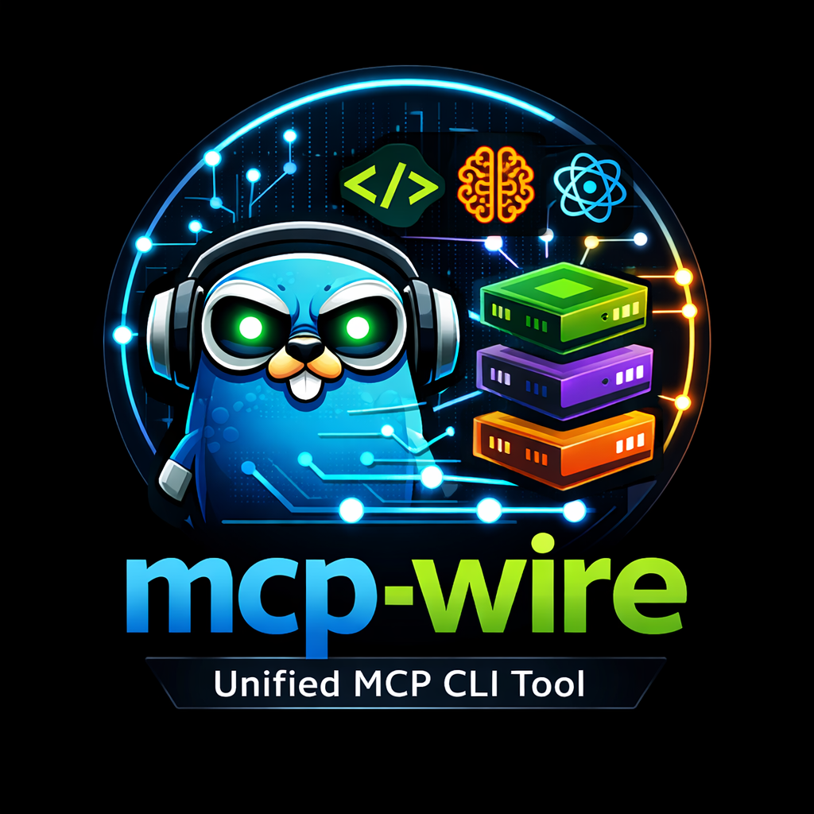

# mcp-wire



mcp-wire is a Go CLI that installs and configures MCP (Model Context Protocol) servers across multiple AI coding tools from one interface.

## How It Works

No manual config editing needed. In a terminal, `mcp-wire` opens a guided menu.

```text
$ mcp-wire
Use Up/Down arrows, Enter to select.
> Main Menu
  Install service
  Uninstall service
  Status
  List services
  List targets
  Exit
```

Install flow (example):

```text
$ mcp-wire install
Install Wizard

Step 1/4: Service
Use Up/Down arrows, Enter to select. Type to filter.
> Select service
  jira - Atlassian Rovo MCP server (OAuth)

Step 2/4: Targets
Detected targets:
  Claude Code (claude) [installed]
  OpenCode (opencode) [installed]
  Codex (codex) [installed]
Use Up/Down arrows, Space to toggle, Right to select all, Left to clear all, Enter to confirm. Type to filter. Esc goes back.
[ ] Claude Code (claude)
[x] OpenCode (opencode)
[ ] Codex (codex)

Step 3/4: Review
Service: jira
Targets: OpenCode
Credentials: prompt as needed
Use Up/Down arrows, Enter to select.
> Apply changes?
  Yes
  No

Step 4/4: Apply
Installing to: OpenCode
  OpenCode: configured
Equivalent command: mcp-wire install jira --target opencode
```

Quick checks:

```bash
mcp-wire status
mcp-wire list services
mcp-wire status --scope effective
```

### Scope-aware installs (Claude Code)

For targets that support scopes (currently Claude Code), you can choose where MCP config is written:

- `user` (default): available across projects
- `project`: only for the current project

```bash
mcp-wire install jira --target claude --scope user
mcp-wire install jira --target claude --scope project
mcp-wire uninstall jira --target claude --scope project
mcp-wire status --scope project
```

## Supported Targets

- `claude` - Claude Code
- `codex` - Codex CLI
- `opencode` - OpenCode

## Supported Services (bundled)

- `context7` - Context7 documentation lookup MCP (OAuth)
- `jira` - Atlassian Rovo MCP server (OAuth)
- `sentry` - Sentry MCP server (OAuth)
- `playwright` - Playwright browser automation MCP (`npx @playwright/mcp@latest`)

Use `mcp-wire list services` and `mcp-wire list targets` to see what is available on your machine.

## Installation

### Homebrew (macOS/Linux)

```bash
brew tap andreagrandi/tap
brew install mcp-wire
```

### Build from source

```bash
git clone https://github.com/andreagrandi/mcp-wire
cd mcp-wire
make build
./bin/mcp-wire
```

## Contributing

Contributions are welcome, especially new service definitions.

- **Add a new service via YAML**: create a file in `services/` (no Go code required).
- **Service schema**: `name`, `description`, `transport`, and either `url` (for `sse`/`http`) or `command`/`args` (for `stdio`).
- **OAuth services**: add `auth: oauth` when applicable so install flows can drive authentication hints/automation.
- **Run checks before PRs**: `make test`, `make test-integration`, `make build`.

Example service file:

```yaml
name: example
description: "Example MCP"
transport: http
auth: oauth
url: "https://mcp.example.com/mcp"
env: []
```
