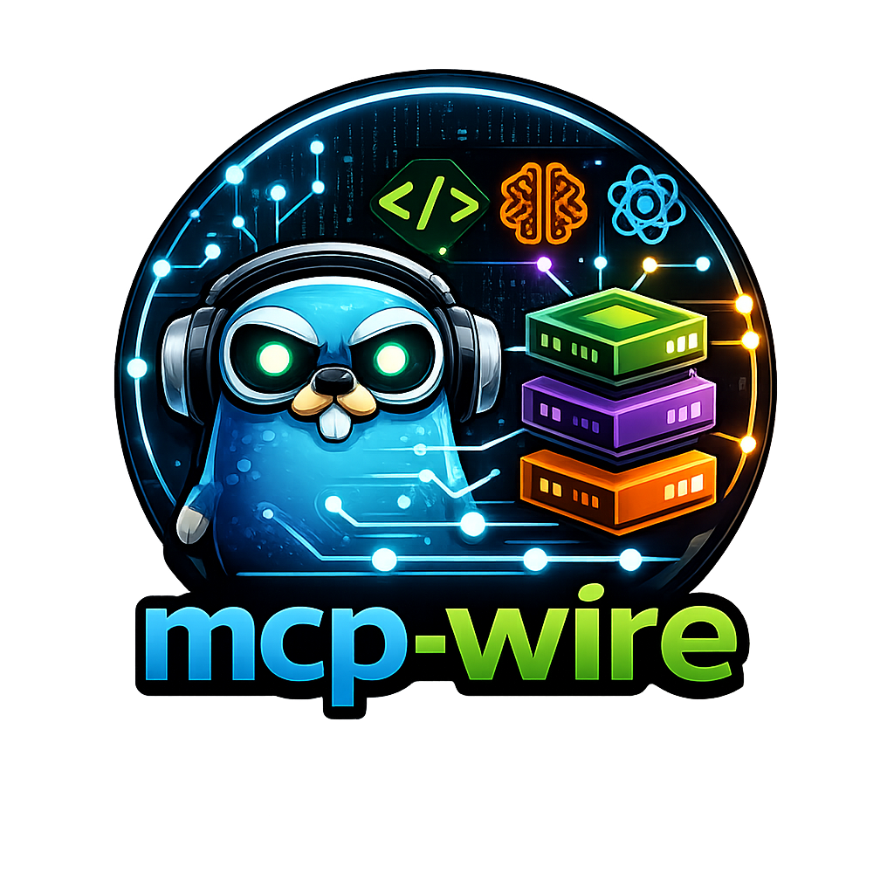

# mcp-wire



mcp-wire is a Go CLI that installs and configures MCP (Model Context Protocol) servers across multiple AI coding tools from one interface.

## How It Works

No manual config editing needed. Run `mcp-wire` to open a full-screen TUI with guided install and uninstall wizards.

### Choose a source

Pick from bundled curated services or the community MCP registry:

```text
mcp-wire — Install

Install › Source

  Where should mcp-wire look for services?

  › Curated services       recommended, maintained by mcp-wire
    Registry services      community-published MCP servers
    Both                   curated + registry combined

↑↓ move  Enter select  Esc back
```

### Search and select a service

Live-filtered search across hundreds of registry entries:

```text
mcp-wire — Install

Install › community ✓ › Service › Targets › Review › Apply

  Search: sentry                                     2 matches

  › ai.sentry/sentry-mcp
    Sentry error tracking and performance monitoring MCP server

    ai.example/sentry-alerts
    Forward Sentry alerts to your AI coding assistant

                          — end of results —

↑↓ move  Enter select  type to filter  Esc back
```

### Review before installing

Registry services show metadata and require explicit confirmation:

```text
mcp-wire — Install

Install › community ✓ › Service › Targets › Review › Apply

  △ Registry Service — not curated by mcp-wire

  ai.sentry/sentry-mcp
  Sentry error tracking and performance monitoring MCP server

  Source:    community registry
  Transport: http
  URL:       https://mcp.sentry.io/sse

  Registry services are community-published. Review before proceeding.

  › Yes, proceed     No, go back

←→ move  Enter confirm  Esc back
```

### Explicit CLI mode

For scripting and CI, explicit commands work without the TUI:

```bash
mcp-wire install jira --target claude --no-prompt
mcp-wire uninstall sentry --target opencode
```

### Diagnostics

Run `mcp-wire doctor` for a read-only diagnostic report. It lists each supported target, whether it is detected on this system, the config path it would write to and whether that file exists, current feature flag state, and the paths mcp-wire uses for its own config, credentials, user-local services, and registry cache. It also prints hints for missing targets and disabled features. The command never writes to any config or credential file.

```bash
mcp-wire doctor
```

### Scope-aware installs (Claude Code)

For targets that support scopes (currently Claude Code), you can choose where MCP config is written:

- `user` (default): available across projects
- `project`: only for the current project

```bash
mcp-wire install jira --target claude --scope user
mcp-wire install jira --target claude --scope project
mcp-wire uninstall jira --target claude --scope project
```

## Supported Targets

- `claude` - Claude Code
- `codex` - Codex CLI
- `opencode` - OpenCode

## Supported Services

### Bundled (curated)

These ship with the binary and work out of the box:

- `context7` - Context7 documentation lookup MCP (OAuth)
- `github` - GitHub MCP server (OAuth)
- `jira` - Atlassian Rovo MCP server (OAuth)
- `linear` - Linear MCP server (OAuth)
- `notion` - Notion MCP server (OAuth)
- `sentry` - Sentry MCP server (OAuth)
- `playwright` - Playwright browser automation MCP (`npx @playwright/mcp@latest`)

### MCP Registry (community)

mcp-wire can also install from the [Official MCP Registry](https://registry.modelcontextprotocol.io), giving access to hundreds of community-published MCP servers. Enable with:

```bash
mcp-wire feature enable registry
```

Once enabled, the install wizard offers a source selection step (Curated / Registry / Both) with live search across all registry entries.

## Credential storage

When you accept the "Save to credential store?" prompt during install, mcp-wire writes the credential to:

```
~/.config/mcp-wire/credentials
```

The file is a plain `KEY=value` list, one credential per line. It is created with mode `0600` (owner read/write only) inside a directory created with mode `0700`. mcp-wire re-applies these permissions on every write, including when an existing directory was previously created with broader permissions.

At install time credentials are resolved in this order, and the first match wins:

1. Process environment variables.
2. The local credentials file above.
3. An interactive prompt (skipped when `--no-prompt` is set).

A few things worth knowing:

- Values are stored in plaintext. mcp-wire does not encrypt them or integrate with the system keychain.
- The same values are written into each target tool's MCP config (e.g. `~/.claude.json`, `~/.codex/config.toml`), so target config files are also created with mode `0600`.
- Interactive prompts mask typed input in both the TUI (password-style echo) and the plain CLI (`term.ReadPassword`). mcp-wire never echoes stored credential values back to the screen, into logs, or into error messages.
- To remove stored credentials for a service, use the uninstall flow and answer "Yes" at the "Remove stored credentials?" prompt, or edit the credentials file directly.

## Installation

### Homebrew (macOS/Linux)

```bash
brew tap andreagrandi/tap
brew install mcp-wire
```

### Build from source

```bash
git clone https://github.com/andreagrandi/mcp-wire
cd mcp-wire
make build
./bin/mcp-wire
```

## Contributing

Contributions are welcome, especially new service definitions.

- **Add a new service via YAML**: create a file in `services/` (no Go code required).
- **Service schema**: `name`, `description`, `transport`, and either `url` (for `sse`/`http`) or `command`/`args` (for `stdio`).
- **Transport values**: `http` (streamable HTTP endpoint), `sse` (Server-Sent Events endpoint), `stdio` (local command-based MCP server).
- **OAuth services**: add `auth: oauth` when applicable so install flows can drive authentication hints/automation.
- **Run checks before PRs**: `make test`, `make test-integration`, `make build`.
- **Update `CHANGELOG.md`**: every PR with a user-visible change (commands, flags, services, targets, install flows, packaging) adds a bullet under `## [Unreleased]`. See the "Changelog updates" section in `AGENTS.md` for what counts and how to format entries. CI enforces this.

Example service file:

```yaml
name: example
description: "Example MCP"
transport: http
auth: oauth
url: "https://mcp.example.com/mcp"
env: []
```

Example `stdio` service:

```yaml
name: example-stdio
description: "Example local MCP"
transport: stdio
command: npx
args: ["-y", "@example/mcp-server"]
env: []
```
